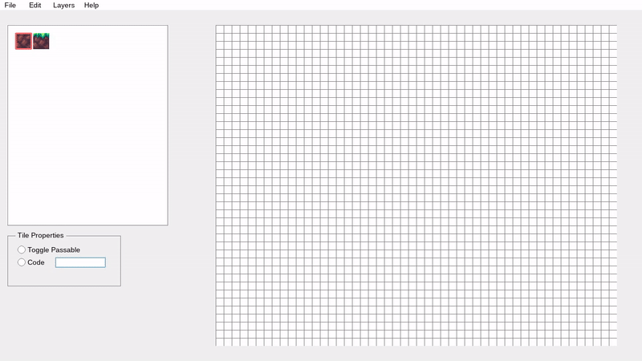

# Pya1M
Pya1M aims to be a set of utility packages for my own game engine made using python just for fun/learning.  
Main library used: pygame

Currently there are only two packages implemented:  
- Level Editor
    - ./src/level_editor  
- GUI
    - ./src/gui

Both were made from scratch using just pygame for the graphics library (including buttons, toolbar, hover effects, drawing tiles, etc).

# Level Editor
The main purpose of this editor is to export maps in a format that can be understood in every game I do. So basically I thought of a specific square on the map 
as an object called a MapSquare:  

Every MapSquare contains the index of the img (based on a specific tileset, for example the third image in the tileset would have index 2) to be used in every layer (layers not implemented yet), the code that identifies the MapSquare (useful for map transitions, traps, etc) and if its passable meaning that a player can go through it.	Note: a tile may be passable but when collided with, a response should occur. i.e: the player colliding with a coin.  
## Format of the map:
Every MapSquare in the map will be saved in a csv-like format, ie: every MapSquare will be separated by a comma (See illustration below). A MapSquare will be saved as a tuple of the form: tile_index;code;passable

(TODO Illustration)

Current Features:
- Place tiles on the grid.
- undo-redo functionality.
- Erase individual tiles.
- Clear the entire map.
- Zoom in and out.
- Import tiles.
- Import map.
- Export map.

# GUI
While there are many GUI libraries I decided to create my own. It has many problems that I should review later on, for now it satisfies what I have in mind.

Curent Features:
- Button
- Toolbar
- RadioButton
- Dropdown
- GroupBox
- Label
- Text Scalling
- TextView
 

